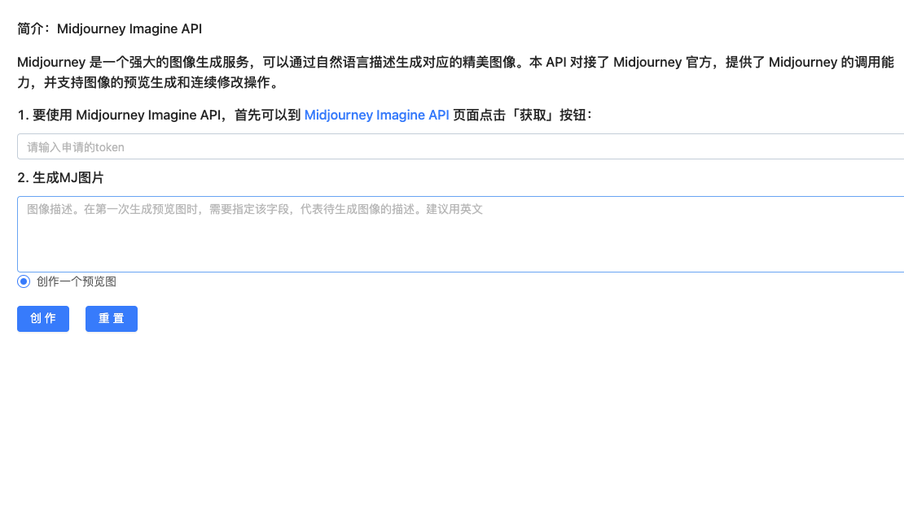
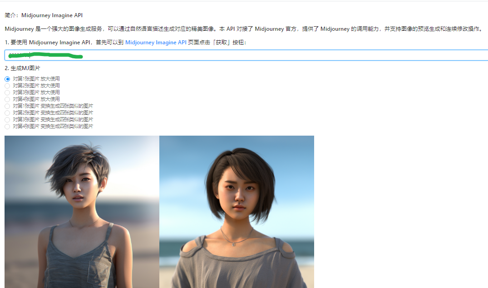
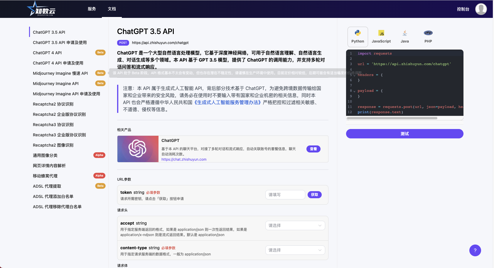

# mj-网站调用
> 知数云 MJ画图小智同学-(mj-api),调用  Midjourney Imagine API 进行画图
> 
> 合作交流微信联系：mytimerun


## Project 
```
yarn install
```
```
yarn serve
```
```
yarn build
```
## 小智MJ线上地址
- [知数云：MJ接口申请](https://auth.zhishuyun.com/auth/login?inviter_id=b01a5684-a3e4-43d6-a7c1-61105ccf9a8c&redirect=https://data.zhishuyun.com)
- [小智同学MJ线上地址](https://mj.lz300.cn/)
- [github地址](https://github.com/hbqjzx/mjxiaozhi)

## 协议

## 知数云


[协议](./LICENSE.md)
## 预览




## 赞助我们

